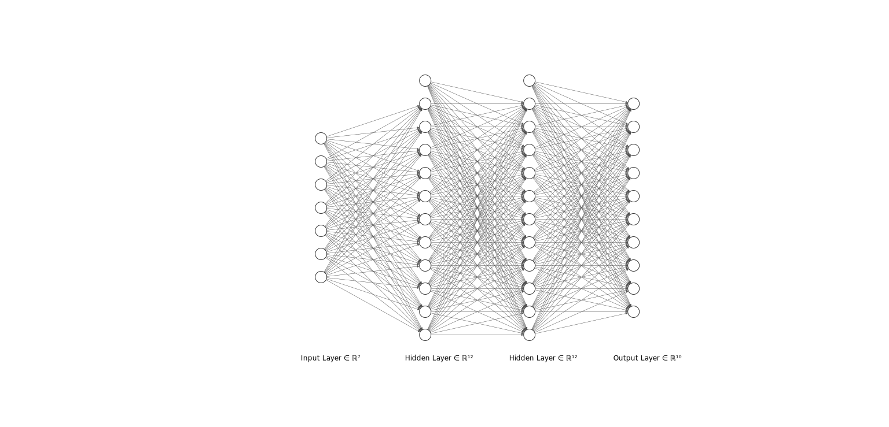

# Neural Network  in JAX

## *Overview: -*
* In this project, I've implemented two hidden layers neural network classifier from scratch using JAX library in Python.

## *Libraries Used: -*
* **[JAX](https://jax.readthedocs.io/en/latest/notebooks/quickstart.html)** - JAX is NumPy on the CPU, GPU, and TPU, with great automatic differentiation for high-performance machine learning research.
* **[Matplotlib](https://matplotlib.org/)** - Matplotlib is a comprehensive library for creating static, animated, and interactive visualizations in Python. Matplotlib makes easy things easy and hard things possible.
* **[scikit-learn](https://scikit-learn.org/stable/)** - Simple and efficient tools for predictive data analysis. Accessible to everybody, and reusable in various contexts. Built on NumPy, SciPy, and matplotlib.
* **[Tenserflow](https://www.tensorflow.org/)** - TensorFlow is an end-to-end open source platform for machine learning. It has a comprehensive, flexible ecosystem of tools, libraries and community resources that lets researchers push the state-of-the-art in ML and developers easily build and deploy ML powered applications.
* **[Keras](https://keras.io/)** - Keras is an API designed for human beings, not machines. Keras follows best practices for reducing cognitive load: it offers consistent & simple APIs, it minimizes the number of user actions required for common use cases, and it provides clear & actionable error messages. It also has extensive documentation and developer guides.

## *Dataset: -*
* **MNIST  -** The MNIST dataset is an acronym that stands for the Modified National Institute of Standards and Technology dataset. It is a dataset of 60,000 small square 28×28 pixel grayscale images of handwritten single digits between 0 and 9.

## *Architecture: -*
* 
* Input Neuron = 784
* Hidden Layers 1 = 24
* Hidden Layer 2 = 24
* Output Layer = 10

## *Classification Matrices: -*
* **[Confusion Matrix](https://scikit-learn.org/stable/modules/generated/sklearn.metrics.confusion_matrix.html)** - A confusion matrix is a table that is often used to describe the performance of a classification model (or "classifier") on a set of test data for which the true values are known.
* **[Classification report](https://scikit-learn.org/stable/modules/generated/sklearn.metrics.classification_report.html)** - A classification report is a performance evaluation metric in machine learning. It is used to show the precision, recall, F1 Score, and support of your trained classification model.

## *References: -*
*  [MNIST](https://www.tensorflow.org/datasets/catalog/mnist)
*  [Classification Matrix and Confusion Matrix](https://www.geeksforgeeks.org/compute-classification-report-and-confusion-matrix-in-python/)
*  [Neural Networks](https://www.deeplearning.ai/program/deep-learning-specialization/)
*  [tenserflow.keras](https://www.tensorflow.org/api_docs/python/tf/keras)  
